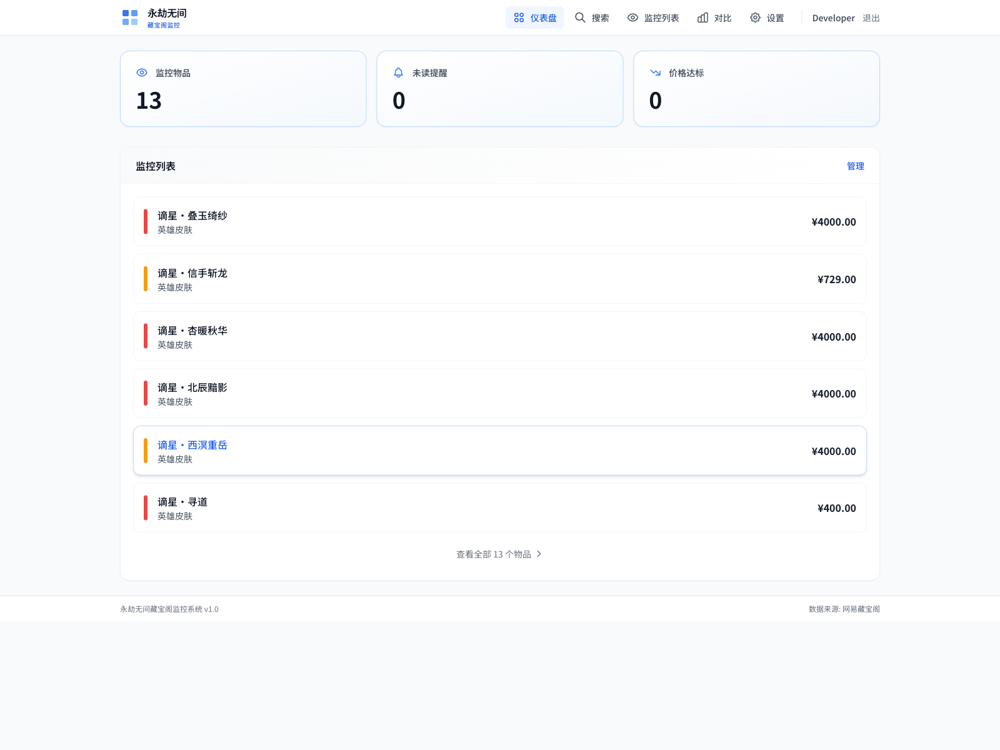
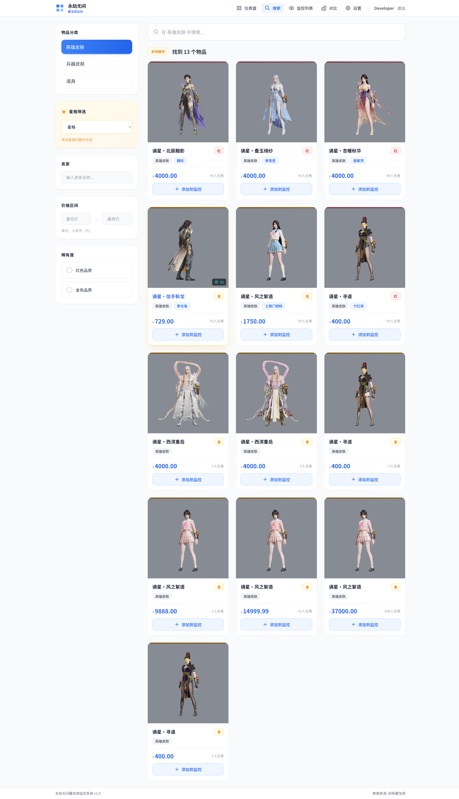
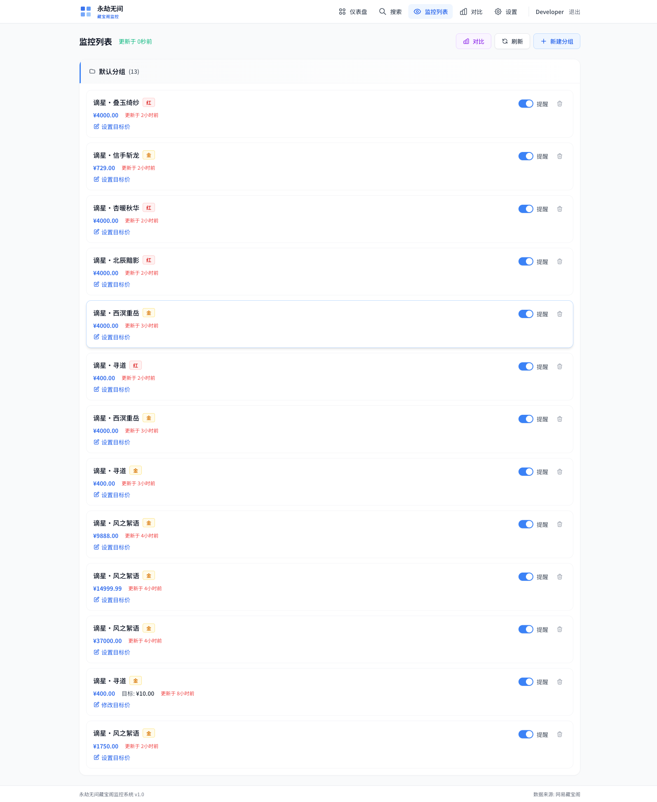
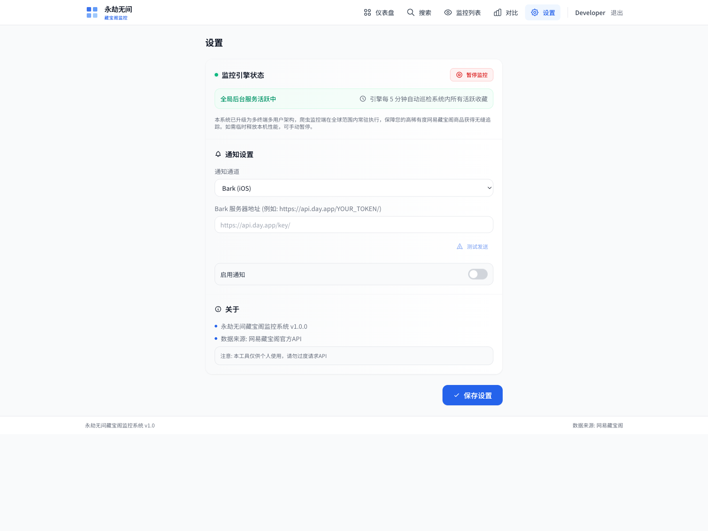
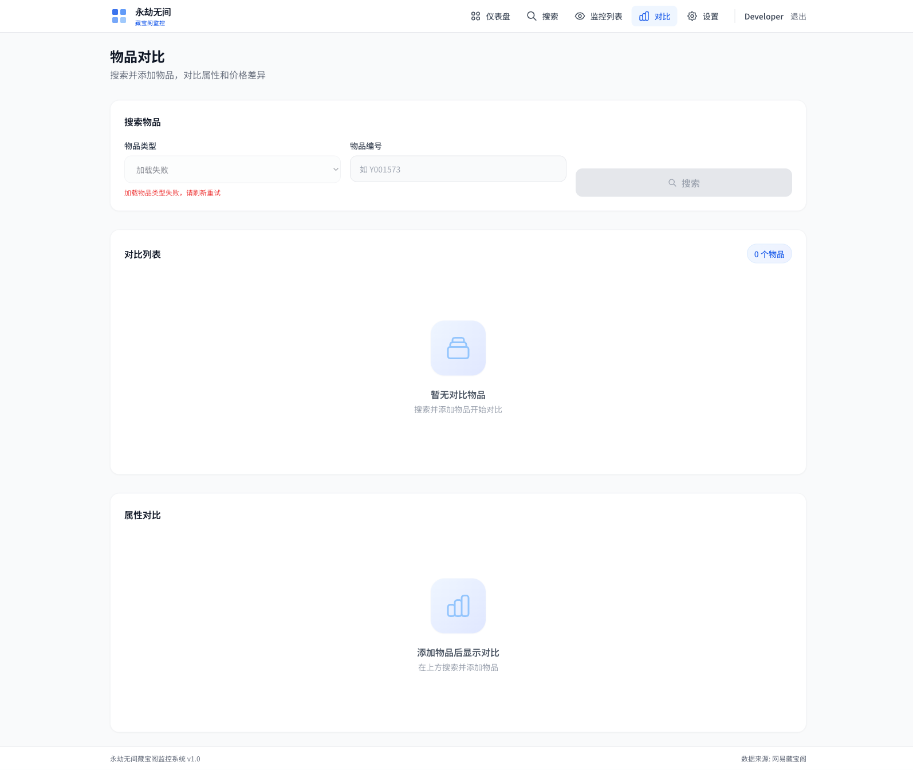
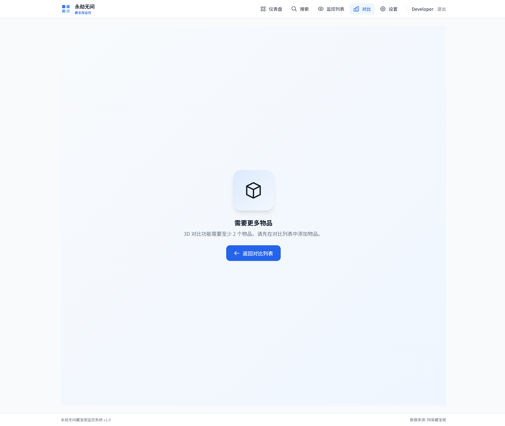

# yjwujian-monitor

永劫无间藏宝阁价格监控系统。它把藏宝阁浏览、价格盯盘、目标价提醒、子物品精细筛选和 3D 对比整合到一个项目里，定位更接近“游戏物品盯盘终端”。

## 当前能力

- 搜索藏宝阁物品，支持分类、关键词、价格区间、卖家、稀有度、星格/变体筛选
- 监控列表管理，支持目标价、提醒开关、分组、备注
- 后端定时巡检价格，价格达标后生成提醒并推送通知
- 多渠道通知：Bark、飞书、钉钉、PushPlus、自定义 Webhook
- 物品详情页 + 子物品在售列表，支持服务端星格槽位筛选
- 2D 对比、3D 对比、原图保存、ZIP 打包导出
- 账号体系：注册、登录、邮箱验证、新设备验证码验证、密码重置 API

## 界面预览

### 仪表盘



### 搜索页



### 监控列表



### 设置页



### 2D 对比页



### 3D 对比页



### 对比功能展示


## 页面与模块

- `Dashboard`：监控概览、未读提醒、达标数量、监控预览
- `SearchPanel`：搜索与多维筛选入口
- `Watchlist`：监控列表、分组管理、目标价编辑、提醒已读
- `ItemDetail` / `SubItemsList`：父物品详情与子物品在售列表
- `ComparePage`：属性对比、编号搜索、图片导出
- `Compare3DPage`：多物品 3D 同屏对比、旋转/缩放/平移/截图
- `Settings`：通知配置、监控状态、测试通知

## 技术栈

- Frontend: React 18 + TypeScript + Vite + TailwindCSS
- Backend: Express + TypeScript + SQLite (`better-sqlite3`)
- Auth: JWT + HTTP-only Cookie + 邮箱验证 + 新设备验证
- Scheduler: `node-cron`
- Notifications: Bark / Feishu / DingTalk / PushPlus / Custom Webhook
- Tooling: Vitest / Playwright / ESLint / TypeScript

## 运行要求

- Node.js `>= 20`
- pnpm `>= 9`

## 快速开始

```bash
pnpm install
pnpm db:init
pnpm dev
```

- 前端默认：`http://localhost:5173`
- 后端默认：`http://localhost:3100`

## 常用命令

```bash
# 开发
pnpm dev
pnpm dev:frontend
pnpm dev:backend

# 构建 / 运行
pnpm build
pnpm preview
pnpm start

# 质量检查
pnpm test
pnpm test:watch
pnpm test:e2e
pnpm lint
pnpm typecheck

# 数据库
pnpm db:init
```

## 环境变量

可参考 `.env.example` 配置：

- `PORT`：后端端口
- `DATABASE_PATH`：SQLite 数据库路径
- `CBG_BASE_URL`：藏宝阁 API 基础地址
- `CBG_REQUEST_DELAY_MS`：请求节流间隔
- `CHECK_INTERVAL_MINUTES`：监控检查间隔
- `RESEND_API_KEY`：邮件服务 API Key
- `APP_URL`：前端访问地址，用于邮件链接生成
- `MONITOR_CONCURRENCY`：监控并发数

## 项目结构

```text
src/
├── backend/
│   ├── db/          # SQLite、schema、初始化与迁移
│   ├── middleware/  # 认证中间件
│   ├── routes/      # auth / items / watchlist / groups / alerts / settings / monitor / compare
│   ├── services/    # cbg、monitor、alert、notification、auth、email、device
│   └── utils/       # jwt、password、date、star-grid 等工具
├── frontend/
│   ├── components/  # 页面与 UI 组件
│   ├── contexts/    # AuthContext
│   └── services/    # API 客户端
└── shared/          # 前后端共享类型
```

## 架构说明

- 后端内置聚合 API / 旧版 API 降级逻辑
- 子物品筛选支持服务端筛选与短 TTL 缓存，避免只筛前端已加载数据
- 监控任务支持有限并发、去重执行、价格快照落库
- 告警侧做了未解决提醒去重，避免重复触发
- 前端轮询支持页面可见性降频，降低后台压力

## 免责声明

- 本项目仅供学习交流使用，不得用于任何商业用途
- 本项目与网易公司、永劫无间游戏官方无任何关联
- 本项目所展示的数据来源于公开渠道，不保证数据的准确性、完整性和时效性
- 使用本项目所造成的任何直接或间接损失，开发者不承担任何责任
- 请遵守相关法律法规和平台服务条款，合理使用本工具

## 文档

- 产品方案包：`docs/product-proposal-package.md`
- 开发计划：`docs/development-plan.md`
- 调研文档：`docs/research/cbg-research-report.md`

## License

MIT
